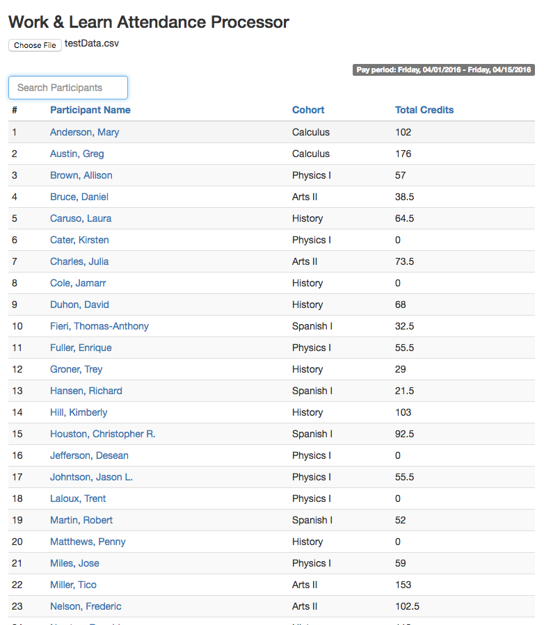
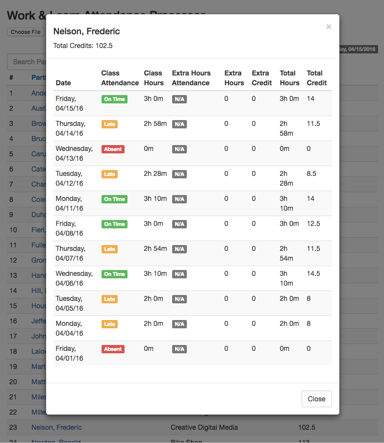

# Attendance Processor

[Live beta (ETO .csv data required)](http://harveysanders.github.io/projects/eto-calc/)
[Test .csv file](test_data/testData.csv)

## Usage
1. Export attendance report from ETO software in `.csv` format
(Test data is available [here](test_data/testData.csv)).
1. Upload the `.csv` file with the 'Choose File' Button
1. The table will be automatically generated.


## Requirements

- Webpack
- ETO account
- Exported attendance data in .csv format


## Development

### Installing Dependencies

From within the root directory for full stack:

```sh
npm install
npm start
```
## Attendance Processor screenshots


